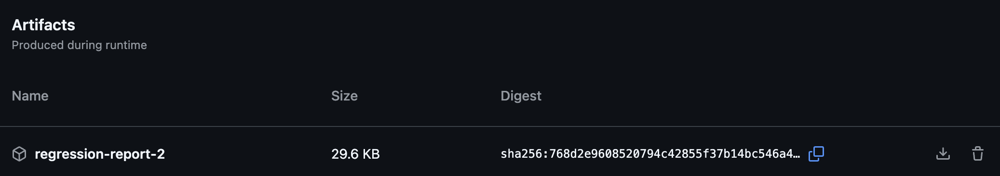
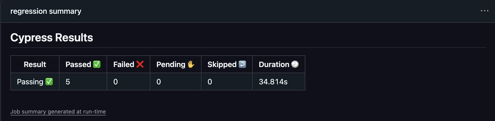

# OrangeHRM-Automation-Practice
QA Automation Practice for OrangeHRM

## 🚀 Usage
You need to have node.js installed (v24 LTS); the first time you need to install the required dependencies:

```bash
npm install
```

For environmental variables please create a `cypress.env.json` in the root as it will pe picked up by the cypress engine on execution. (for this test suite we only need two env vars USERNAME and PASSWORD for logging to the OrangeHRM application)

You can run your tests with this command:

```bash
npm test -- <cypress options>
```

By default electron is used for the tests, if you want to use another browser use the -b option:

```bash
npm test -- -b chrome
```

You can also launch the Cypress GUI:

```bash
npm run cypress:open
```

# ⚙️ GitHub Actions

This repository is configured with GitHub Actions, which allows you to run jobs in parallel or sequentially on demand. You can take advantage of this feature to execute automated tests or perform other tasks. Additionally, the actions are designed to run a functional healthcheck test every 3 hours and a nightly regression every night at 3AM CEST (UTC+2).

On every PR it scans the code for secrets exposure as well as on demand using the action Secret Scanning.

To run GitHub Actions jobs, navigate to the "Actions" tab in your GitHub repository. From there, you can select the desired workflow and choose to run it in parallel or sequentially. This flexibility allows you to customize the execution based on your needs.

## 🔀 Parallel Execution:

To run jobs in parallel, select the workflow `Run tests in a Matrix` and click on the "Run workflow" button. This will trigger the selected workflow, and multiple jobs will run concurrently.

## 🔁 Sequential Execution:

To run jobs sequentially, select the workflow `Run tests Sequentially` and click on the "Run workflow" button. This will ensure that each job starts only after the previous one has completed.

By leveraging GitHub Actions with parallel or sequential execution, you can efficiently automate your workflows and perform comprehensive testing while persisting new user data in the database. (Also there will be an artifact to download with the new test results after finishing the test suite tests). This artifact will persist for 30 days.



And a summary for the results directly visible in the GitHub Actions Summary page.


